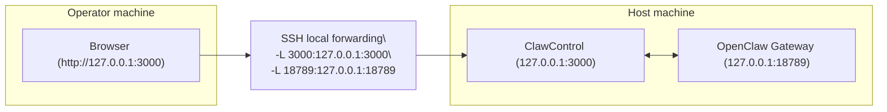

This page describes the supported way to run ClawControl on a host machine while accessing it remotely.

ClawControl remains loopback-only. Remote access is provided via SSH local port forwarding (including SSH over Tailscale), not by exposing the service on LAN/WAN.

## Topology



## Host Setup

Prerequisites:

- Node.js `20+`
- npm `10+`
- OpenClaw CLI available on `PATH` (or `OPENCLAW_BIN` configured)

Install and start ClawControl:

```bash
git clone https://github.com/salexandr0s/ClawControl.git
cd ClawControl
npm install
npm run db:migrate
npm run build --workspace=clawcontrol
./start.sh --web
```

Verify loopback-only listeners on the host:

```bash
lsof -nP -iTCP:3000 -sTCP:LISTEN
lsof -nP -iTCP:18789 -sTCP:LISTEN
```

Expected: listeners on `127.0.0.1` and/or `::1` only.

## Operator Access (SSH Tunnel)

From the operator machine, create SSH local forwards to the host:

```bash
ssh -L 3000:127.0.0.1:3000 -L 18789:127.0.0.1:18789 <user>@<host>
```

Then open:

- `http://127.0.0.1:3000`

If you use Tailscale, use the host's tailnet DNS name in the SSH command.

## Not Allowed

- Binding ClawControl to `0.0.0.0`
- Exposing ClawControl via reverse proxy (nginx/caddy) to LAN/WAN
- Using `tailscale serve` to publish ClawControl ports
- Public tunnels (ngrok/cloudflared) for ClawControl

## Last updated

2026-02-13

## Related pages

- [Local-only Networking Enforcement](/security/networking-local-only)
- [Tailscale Tunnel (SSH Port Forwarding)](/remote/tailscale-ssh-tunnel-only)
- [Process Model](/product/local-process-model)
- [Run in Web Mode](/quickstart/web-only)
