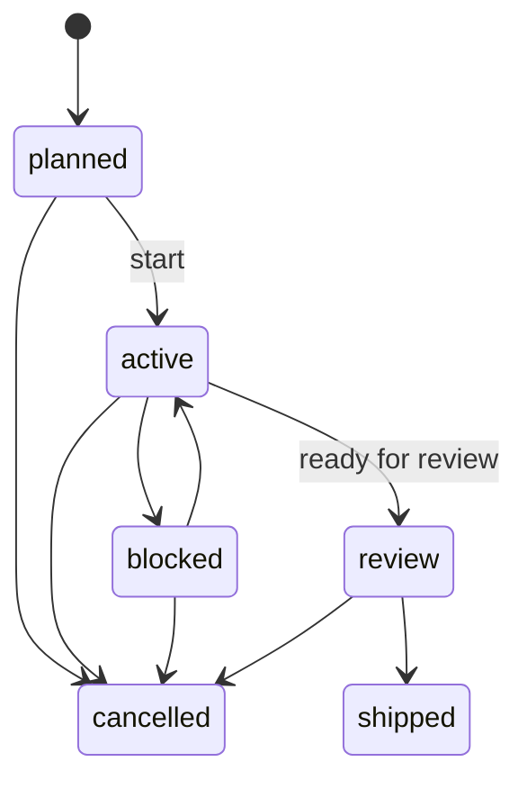
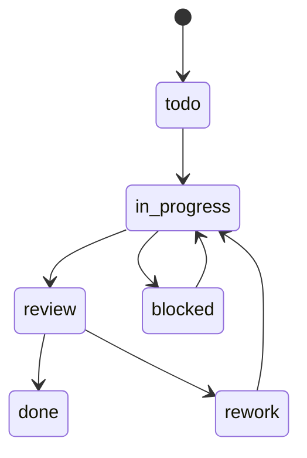
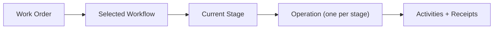

This page describes implemented work tracking behavior for work orders and operations.

## Work Orders

Work order capabilities include:

- create/update/list/query by state, priority, owner
- deterministic workflow selection and workflow linkage
- manager-engine stage tracking fields (`workflowId`, `currentStage`)
- status transitions with activity logging

Implemented states: `planned`, `active`, `blocked`, `review`, `shipped`, `cancelled`.

## Operations

Operation capabilities include:

- manager-created operations per workflow stage
- list/query by work order, station, and status
- manager-controlled status transitions with activity logging
- assignee/dependency persistence
- loop/story visibility for loop stages (`/api/operations/:id/stories`)

Implemented statuses: `todo`, `in_progress`, `blocked`, `review`, `done`, `rework`.

## Lifecycle Diagrams

Work order lifecycle (typical):

Operation lifecycle (typical):

Work order stage mapping:

## UI Surfaces

- `/work-orders`: table + kanban views with explicit Start actions.
- `/work-orders/[id]`: workflow/stage progress plus operation and story visibility.
- `/runs`: operation-focused telemetry/inspection (manual status controls removed).

## Manager Stage Engine Integration

Work order execution uses manager-stage-engine endpoints:

- `POST /api/work-orders/:id/start` (canonical start)

Manual operation graph mutation and manual operation status transitions are blocked via API guards.

## Last updated

2026-02-13

## Related pages

- [Core Concepts](/product/core-concepts)
- [Approvals and Governance](/features/approvals-governor)
- [Work Orders, Operations, and Receipts (API)](/api/work-orders-operations-receipts)
