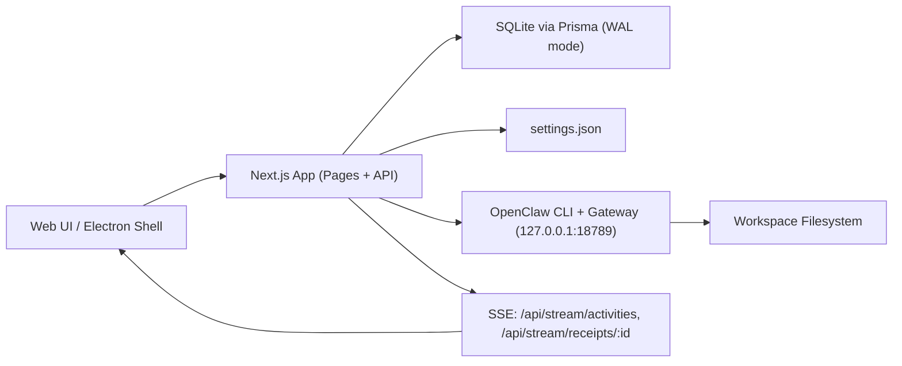

This page describes the runtime architecture that is currently implemented.

## High-level Diagram

## Runtime Layers

- Presentation layer: dashboard pages in `/apps/clawcontrol/app/(dashboard)`.
- API layer: route handlers in `/apps/clawcontrol/app/api/**/route.ts`.
- Domain/data layer: repository interfaces in `/apps/clawcontrol/lib/repo`.
- Persistence layer: Prisma + SQLite (`DATABASE_URL`) with startup initialization and migration application.
- External adapter layer: OpenClaw CLI command runner with allowlist restrictions.

## Network Boundaries

- HTTP app and API are local-only by policy and proxy host guard.
- OpenClaw gateway defaults to loopback URLs (`http://127.0.0.1:18789`, `ws://127.0.0.1:18789`).
- Remote usage is designed around SSH port forwarding tunnels, not network bind exposure.

## Telemetry + Streaming

- Activity events are published to a pubsub emitter and streamed by `/api/stream/activities`.
- Receipt chunks/finalization are streamed by `/api/stream/receipts/:id`.
- SSE endpoint concurrency is capped at 50 connections per endpoint.

## Last updated

2026-02-13

## Related pages

- [Data Flow](/product/data-flow)
- [Process Model](/product/local-process-model)
- [Streaming (SSE)](/api/streaming)
- [Local-only Networking Enforcement](/security/networking-local-only)
