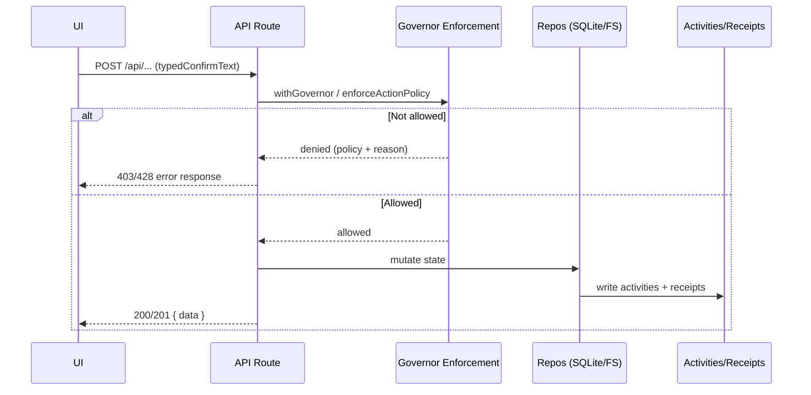

This page tracks key request/data paths from UI action to persistence and audit.

## Work Order Update Flow

1. UI action calls `/api/work-orders` or `/api/work-orders/:id`.
2. Governor checks run for protected transitions.
3. Repository updates SQLite rows.
4. Activity records are written.
5. Updated DTOs return to UI.

## Protected Action Flow (Typed Confirm)

1. Client includes `typedConfirmText` in request body.
2. Route enforces policy via `withGovernor` (wrapper) or `enforceActionPolicy` / `enforceGovernor` (helpers).
3. Invalid/missing confirmation returns `403` or `428` with policy metadata (depending on the route).
4. If allowed, action executes and logs activity/receipt data.

## Console Message Flow

- Agent-scoped send: `/api/openclaw/console/sessions/:id/send` (`console.agent.chat`).
- Session-scoped chat: `/api/openclaw/console/sessions/:id/chat` (`console.session.chat`, true session routing by session key).
- Both paths create receipts and activity entries.

## Workspace Edit Flow

1. UI resolves file entry ID.
2. Route validates path policy and protected-file rules.
3. Optional typed-confirm gate applies based on action/file.
4. Filesystem write is performed.
5. Response returns updated file metadata/content.

## Maintenance Flow

- Health/recover endpoints execute allowlisted OpenClaw commands.
- Output streams into receipts.
- Parent and child receipts are linked in recovery flows.

## Last updated

2026-02-13

## Related pages

- [Approvals and Governance](/features/approvals-governor)
- [Work Orders and Operations](/features/work-orders-operations)
- [Maintenance and Recovery](/features/maintenance-recovery)
- [API Overview](/api/overview)
