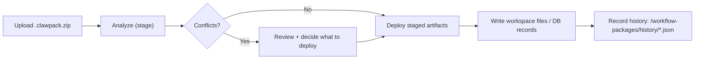

This page documents the `.clawpack.zip` package format used by ClawControl for import/deploy/export flows.

## Package Format

Extension:

- `.clawpack.zip`

Required root manifest:

- `clawcontrol-package.yaml`

Supported package kinds:

- `agent_template`
- `agent_team`
- `workflow`
- `team_with_workflows`

## Supported Package Contents

Packages may include:

- `agent-templates/<templateId>/...`
- `workflows/<workflowId>.yaml`
- `teams/<teamId>.yaml`
- `selection/workflow-selection.yaml`
- `marketplace/listing.yaml` (optional listing metadata for marketplace ingestion)

## Import / Deploy Flow

Package import is a two-step flow:

1. Analyze/stage package (`POST /api/packages/import`)
2. Deploy staged package (`POST /api/packages/deploy`)

Analyze reports:

- manifest metadata
- discovered artifact counts
- conflict detection (templates/workflows/teams)
- temporary stage id for deployment

Deploy supports scoped application toggles:

- templates
- workflows
- teams
- selection

## Rollback Behavior

Deployment is best-effort transactional:

- template filesystem writes are rolled back on failure
- created workflows/teams are reverted when possible
- previous selection overlay is restored if selection deployment fails

## Export

Package exports are available via API:

- `GET /api/packages/:id/export?kind=workflow`
- `GET /api/packages/:id/export?kind=agent_template`
- `GET /api/packages/:id/export?kind=agent_team`
- `GET /api/packages/:id/export?kind=team_with_workflows`

Exported packages include:

- `clawcontrol-package.yaml` (runtime manifest)
- `marketplace/listing.yaml` (optional marketplace sidecar metadata)

## Security and Governance

All mutating package routes require:

- operator session + CSRF
- action-policy enforcement (typed confirm and/or approvals, depending on action kind)

## Workspace History

Analyze/deploy/export events are recorded under:

- `/workflow-packages/history/*.json`

These records are local operational traces for auditability and debugging.

## Last updated

2026-02-13

## Related pages

- [Workflows, Teams, and Packages](/features/workflows-packages-teams)
- [Workflows, Teams, and Packages (API)](/api/workflows-teams-packages)
- [Workflows](/reference/workflows)
