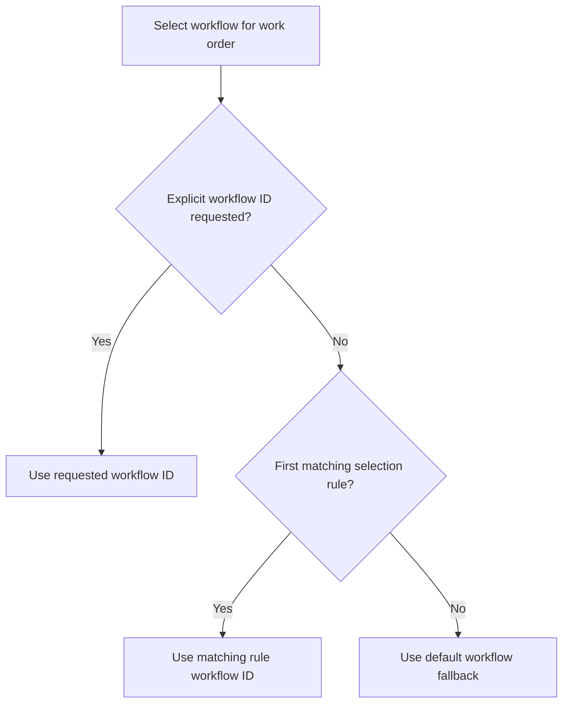

This page is the reference for how workflows are represented, loaded, selected, and executed in ClawControl.

## What a Workflow Is

A workflow is a YAML-defined execution plan used by the manager stage engine.

Each workflow includes:

- `id`
- `description`
- ordered `stages`

Each stage defines the assigned role/station and optional gating or loop configuration.

## Built-in vs Custom Workflows

ClawControl loads workflows from two sources:

- Built-in workflows (shipped with the app): read-only
- Custom workflows (stored in the workspace under `/workflows/*.yaml`): editable

Rules:

- Built-in workflows cannot be edited or deleted.
- Built-ins can be cloned to create editable custom versions.
- Custom workflow IDs must be unique across built-in and custom registries.

## Workflow Selection Rules

Workflow selection is deterministic and is loaded from:

- built-in selection config: `config/workflow-selection.yaml`
- optional workspace override: `/workflows/workflow-selection.yaml`

Resolution order:

## Manager Engine Contract

All non-system work executes through:

`work order -> workflow stage -> operation -> completion -> next stage`

The engine reads workflow definitions at runtime from the merged registry (built-in + custom).

## Workspace Snapshot Files

On workflow/selection changes, ClawControl writes merged snapshots to the workspace:

- `/workflows/clawcontrol-resolved-workflows.yaml`
- `/workflows/clawcontrol-resolved-selection.yaml`

These are portability/interoperability snapshots and should be treated as generated files.

## UI Surface

Use the **Workflows** UI surface to:

- list workflows (built-in + custom)
- inspect stages and usage
- create/edit custom workflow YAML
- clone built-ins
- import workflow YAML
- export workflow YAML
- export package artifacts

## API Endpoints

See the API reference for the full list of workflow endpoints.

## Last updated

2026-02-13

## Related pages

- [Workflows, Teams, and Packages](/features/workflows-packages-teams)
- [Workflows, Teams, and Packages (API)](/api/workflows-teams-packages)
- [Work Orders and Operations](/features/work-orders-operations)
- [Package Artifacts](/reference/packages)
