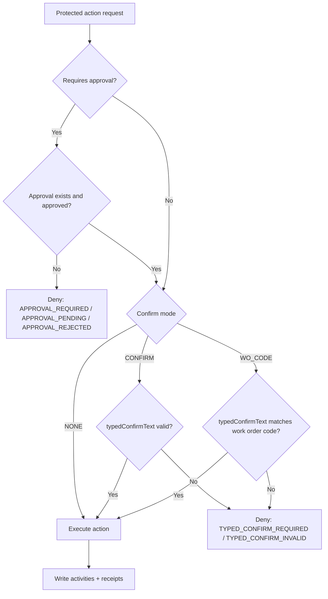

This page documents approval and typed confirmation enforcement.

## Confirmation Modes

- `NONE`: no typed confirm required
- `CONFIRM`: requires exact confirmation text
- `WO_CODE`: requires work order code confirmation

## Route-level Enforcement

Mutating endpoints use server enforcement wrappers so policy cannot be bypassed from client-side UI changes.

## Decision Tree (Simplified)

## Common Error Outcomes

- `APPROVAL_REQUIRED`
- `APPROVAL_PENDING`
- `APPROVAL_REJECTED`
- `TYPED_CONFIRM_REQUIRED`
- `TYPED_CONFIRM_INVALID`

## UI Integration

Protected action UX uses a typed confirmation modal that renders policy/risk context and expected confirm string.

## Auditability

Successful and denied actions are logged into activities; command-like actions also produce receipts.

## Last updated

2026-02-13

## Related pages

- [Approvals and Governance](/features/approvals-governor)
- [Work Orders, Operations, and Receipts (API)](/api/work-orders-operations-receipts)
- [Maintenance and Recovery](/features/maintenance-recovery)
